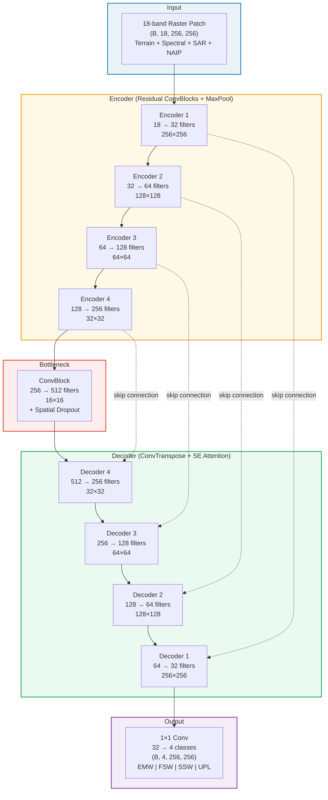
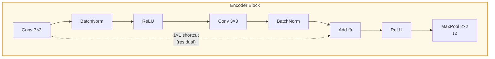
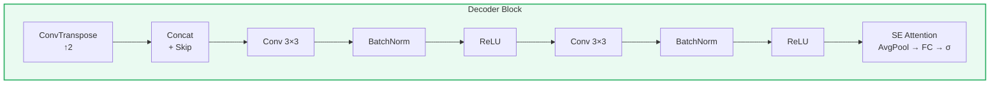
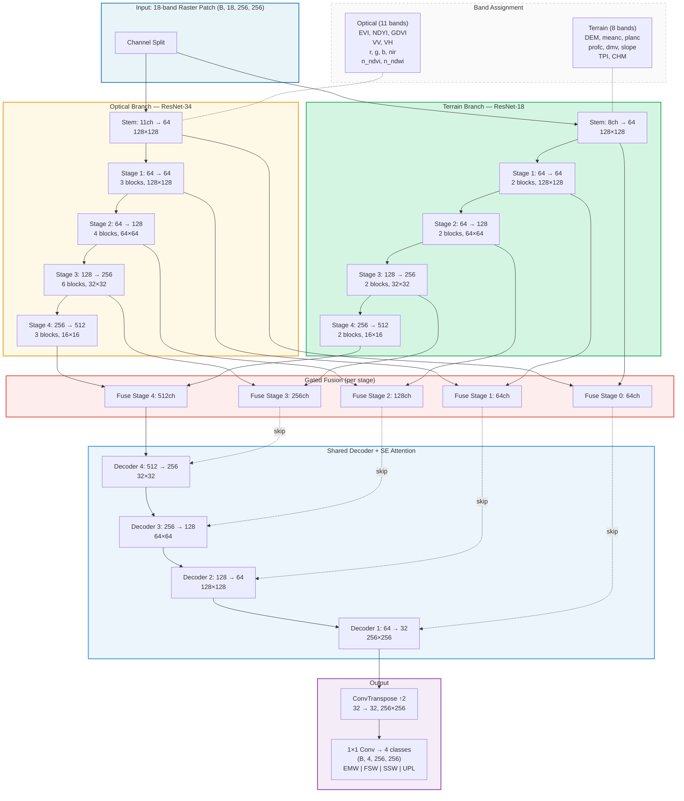
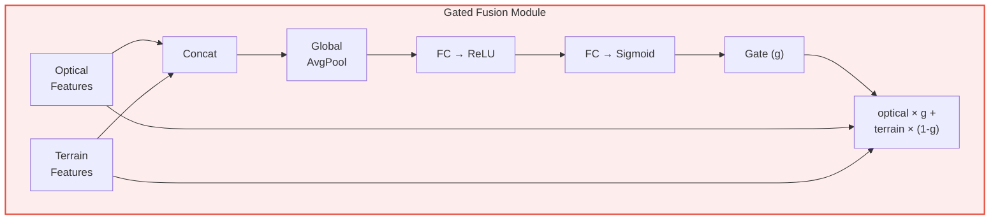

# Model Architecture Diagrams

Mermaid diagrams for the U-Net and Dual-Branch U-Net architectures.
Open this file in any Mermaid-compatible viewer (GitHub, VS Code with Mermaid extension, mermaid.live, etc.)

---

## U-Net with Residual Blocks + SE Attention

### Encoder Block Detail

### Decoder Block Detail

---

## Dual-Branch U-Net (ResNet-34 + ResNet-18 with Gated Fusion)

### Gated Fusion Detail

---

## Rendering Instructions

1. **GitHub**: Push this file — GitHub renders Mermaid natively
2. **VS Code**: Install "Markdown Preview Mermaid Support" extension
3. **Web**: Paste diagrams at [mermaid.live](https://mermaid.live) — export as SVG/PNG
4. **Slides**: Export as SVG from mermaid.live, then insert into PowerPoint/Google Slides
