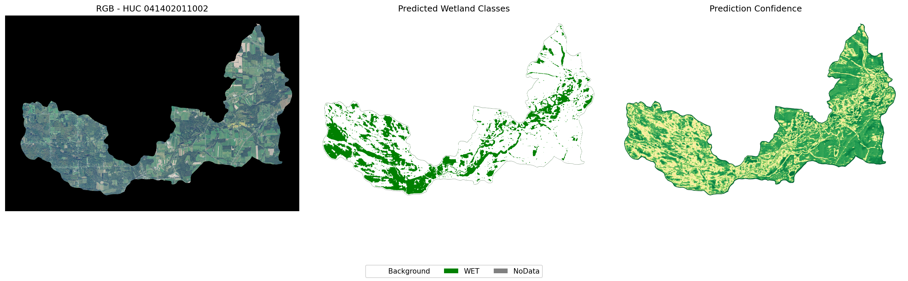

# NYS Wetlands Deep Learning

A deep learning pipeline for wetland semantic segmentation in New York State. The project uses a U-Net architecture trained on 11-band imagery (NAIP RGB/NIR, NDVI, NDWI, DEM, CHM, slope, TPI, and geomorphology) to classify pixels into five wetland categories: background, open water (OWW), emergent (EMW), forested (FSW), and scrub-shrub (SSW) wetlands. Training data is derived from the National Wetlands Inventory and organized by HUC12 watersheds for systematic processing across the state. These are initial results

